```{r setup, include=FALSE}
knitr::opts_chunk$set(echo = TRUE)
```


# 問題１：両群間計量データの平均値を比較する

<!-- 近年の研究によると，ビタミンＥはがんの発症予防に有用かもしれないと言われている．ある研究者がこの仮説を検証したくて， -->
２００名の認知症患者に，認知機能テスト(cognitive test, COG)と脳萎縮の進行度 (brain atrophy, 脳体積の平均年間減少率，%) の検査を行った．COG，と脳萎縮のデータは値が大きいほど認知症の進行を示している．また，すべての参加者から採取した血液検体を利用して，ある遺伝子の変異の有無の検査も行った．これらデータを以下の表にまとめた：

\bigskip
\begin{center}
\begin{tabular}{|l|l|l|l|l|}\hline
変数                     & \multicolumn{2}{c|}{遺伝変異あり (n = 50)}     & \multicolumn{2}{c|}{遺伝変異なし (n = 150)}   \\\hline
                       & \vtop{\hbox{\strut 平均値}\hbox{\strut (mean)}}&\vtop{\hbox{\strut  標準偏差}\hbox{\strut (standard deviation) }} & \vtop{\hbox{\strut 平均値}\hbox{\strut (mean)}}&\vtop{\hbox{\strut  標準偏差}\hbox{\strut (standard deviation) }} \\\hline
認知能力テスト，COG            & 69.2       & 9.0                       & 60.2       & 9.0                       \\
脳萎縮度, atrophy, \%/year & 0.67       & 0.21                      & 0.23       & 0.10                     \\\hline
\end{tabular}
\end{center}
\bigskip

1. 帰無仮説を「遺伝子変異ありと変異なし両群の間で，COGの平均値は等しい」とする．上記のデータ及び適切な方法を使って検定し，検定の結果を分かりやすく説明せよ．なお，分散が等しいと仮定できる場合，以下の式で両群の共通標準偏差が計算できる：

\begin{equation}
  \label{eq:1}
S = \sqrt{\frac{(n_A - 1)S^2_A + (n_B - 1)S^2_B}{n_A + n_B -2}}
\end{equation}

- $S_A:$ A群の標準偏差；
- $n_A:$ A群の人数；
- $S_B:$ B群の標準偏差；
- $n_B:$ B群の人数；
- $S:$ A群及びB群の共通標準偏差；
- $n_A + n_B -2:$ 分散が等しい時の自由度．

また，EZR で t 値，自由度 (degree of freedom)を使って P 値を計算する時は，以下のコマンドを利用してください：

```{r eval=FALSE}
2*pt(t value, degree of freedom, lower=FALSE)
```


## 答え  (回答用紙へ)

<!-- 両群の標準偏差は 9.0 と推定され，分散が等しいと仮定できるから，Student の t 検定を行う： -->

<!-- $$ -->
<!-- T = \frac{\bar{X}_A - \bar{X}_B}{S\sqrt{1/n_A + 1/n_B}} -->
<!-- $$ -->

<!-- 公式(\ref{eq:1})により，共通分散/標準偏差を推定する： -->
<!-- $$ -->
<!-- \begin{aligned} -->
<!-- \because\;\;  S & = \sqrt{\frac{(n_A - 1)S^2_A + (n_B - 1)S^2_B}{n_A + n_B -2}} \\ -->
<!-- \therefore\;\; S & =  \sqrt{\frac{(50 - 1)9^2 + (150 - 1)9^2}{50 + 150 -2}} = 9 \\ -->
<!-- \Rightarrow\;\; T & = \frac{\bar{X}_A - \bar{X}_B}{S\sqrt{1/n_A + 1/n_B}} \\  -->
<!--                   & = \frac{69.2 - 60.2}{9\times\sqrt{1/50 + 1/150}} \\  -->
<!--                   & = \frac{9}{9\times0.1633} = 6.1237 -->
<!-- \end{aligned} -->
<!-- $$ -->

<!-- 自由度 (degree of freedom)は $n_A + n_B -2 = 198$，P値の計算は EZR を利用する： -->

<!-- ```{r eval=TRUE} -->
<!-- 2*pt(6.1237, 198, lower=FALSE) -->
<!-- ``` -->


<!-- ```{r pvalue00, cache=TRUE, echo=FALSE, fig.asp=.7, fig.width=6, fig.align='center', out.width='90%'} -->
<!-- 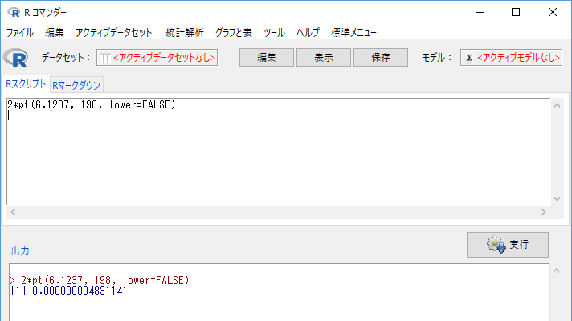 -->
<!-- ``` -->
<!-- \bigskip -->


<!-- \clearpage -->
<!-- \thispagestyle{empty} -->
<!-- \phantom{a} -->
<!--   -->

以下のコードをRスクリプトに入力して，実行をクリックしてください．自分の検定結果と一致するかを確認してください．

```{r eval=FALSE}
source("http://aoki2.si.gunma-u.ac.jp/R/src/my_t_test.R", encoding="euc-jp")
my.t.test(50, 69.2, 9.0^2, 150, 60.2, 9.0^2, var.equal=TRUE)
```

```{r myttest00, cache=TRUE, echo=FALSE, fig.asp=.7, fig.width=6, fig.align='center', out.width='90%'}

```


<!-- \underline{手計算の結果と一致していると確認できる．} -->

<!-- この検定結果は「両群のCOG平均値が等しい」という帰無仮説を棄却するために非常に強い証拠を提供したと言える． -->

<!-- There is strong evidence against the null hypothesis that the means of COG are the same in the two groups. -->

 
 

2. 遺伝子変異ありとなしの群の間の脳萎縮度 (atrophy) を比較する場合， 1. と同じ検定方法を用いてよいか？ それを判断するにはどの検定方法を使えばよいかを説明し，実際にこの検定方法を実施せよ．


なお，EZR で F 値，両群の分散，両群それぞれの自由度 (df) を使って P 値を計算する時は，以下のコマンドを利用してください：

```{r eval=FALSE}
2*pf(F value, df in group 1, df in group 2, lower=FALSE)
```


## 答え (回答用紙へ)

<!-- テーブルから両群の標準偏差はそれぞれ 0.21, 0.10 だと推定され，分散 (variance) が等しいという前提が満たされていない．１．の検定方法を使う時には，両群の分散が等しいという前提条件が必須だから，同じ Student t 検定を行うことができない．「両群の分散」が等しいという帰無仮説を検定するには F 検定を利用する： -->

<!-- $$ -->
<!-- \begin{aligned} -->
<!-- F & = \frac{S^2_A}{S^2_B} \\ -->
<!--   & = \frac{0.21^2}{0.10^2} \\ -->
<!--   & = 4.41 -->
<!-- \end{aligned} -->
<!-- $$ -->


<!-- 自由度 (degree of freedom)はそれぞれ $n_A - 1 = 49; n_B -2 = 149$，P値の計算は EZR を利用する： -->

<!-- ```{r eval=TRUE} -->
<!-- 2*pf(4.41, 49, 149, lower.tail = FALSE) -->
<!-- ``` -->


<!-- ```{r ftest, cache=TRUE, echo=FALSE, fig.asp=.7, fig.width=6, fig.align='center', out.width='90%'} -->
<!-- 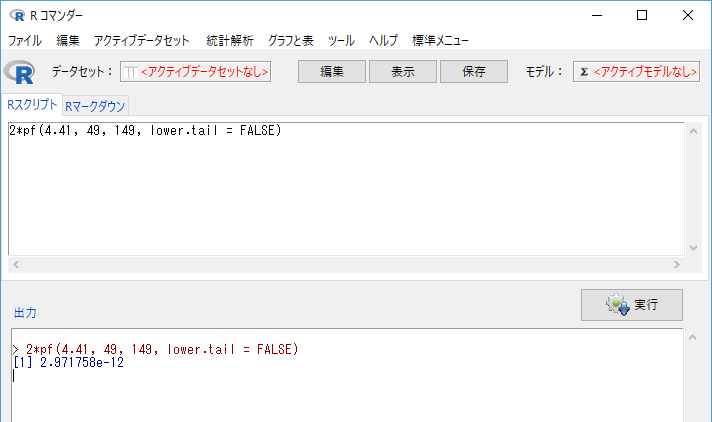 -->
<!-- ``` -->

以下のコードをRスクリプトに入力して，実行をクリックしてください．自分の検定結果と一致するかを確認してください．

```{r eval=FALSE}
source("http://aoki2.si.gunma-u.ac.jp/R/src/my_var_test.R", encoding="euc-jp")
my.var.test(50, 0.21^2, 150, 0.1^2)
```

\bigskip\bigskip\bigskip\bigskip\bigskip

```{r ftest01, cache=TRUE, echo=FALSE, fig.asp=.7, fig.width=6, fig.align='center', out.width='90%'}

```

<!-- \underline{手計算の結果と一致していると確認できる．} -->


<!-- この検定結果は「両群の脳萎縮度の分散が等しい」という帰無仮説を棄却するために非常に強い証拠を提供したと言える． -->

<!-- There is strong evidence against the null hypothesis that the variances of atrophy are the same in the two groups. -->

 
 

3.  2.の結果を踏まえて，帰無仮説「両群の脳萎縮度の平均値が等しい」を検定せよ．なお，両群の分散が等しいという前提が満たされていない時に，自由度(df)の計算式は以下となる：


\begin{equation}
\label{eq:2}
\mathbf{df} = \frac{(S^2_A/n_A + S^2_B/n_B)^2}{(S_A^2/n_A)^2/(n_A-1)+(S_B^2/n_B)^2/(n_B-1)}
\end{equation}

また，EZR で t 値，自由度 (df)を使って P 値を計算する時は，以下のコマンドを利用してください：

```{r eval=FALSE}
2*pt(t value, df, lower=FALSE)
```


## 答え (回答用紙へ)

<!-- 2.の検定結果から，「両群の脳萎縮度の分散が等しい」という帰無仮説を棄却されたため，Welch の t 検定を採用する． -->

<!-- $$ -->
<!-- \begin{aligned} -->
<!-- \Rightarrow\;\; T & = \frac{\bar{X}_A - \bar{X}_B}{\sqrt{S^2_A/n_A + S^2_B/n_B}} \\  -->
<!--                   & = \frac{0.67 - 0.23}{\sqrt{0.21^2/50 + 0.10^2/150}} \\  -->
<!--                   & = \frac{0.44}{\sqrt{0.0009486667}} = 14.28551 -->
<!-- \end{aligned} -->
<!-- $$ -->

<!-- 自由度は公式(\ref{eq:2})により計算できる： -->

<!-- $$ -->
<!-- \begin{aligned} -->
<!-- \mathbf{df} & = \frac{(S^2_A/n_A + S^2_B/n_B)^2}{(S_A^2/n_A)^2/(n_A-1)+(S_B^2/n_B)^2/(n_B-1)} \\ -->
<!--             & = \frac{(0.21^2/50 + 0.10^2/150)^2}{(0.21^2/50)^2/(50-1)+(0.10^2/150)^2/(150-1)} \\ -->
<!--             & = 58.58105 -->
<!-- \end{aligned} -->
<!-- $$ -->
<!-- P値の計算は EZR を利用する： -->

<!-- ```{r eval=TRUE} -->
<!-- 2*pt(14.28551, 58.58105, lower=FALSE) -->
<!-- ``` -->

<!-- ```{r pvalue01, cache=TRUE, echo=FALSE, fig.asp=.7, fig.width=6, fig.align='center', out.width='90%'} -->
<!-- 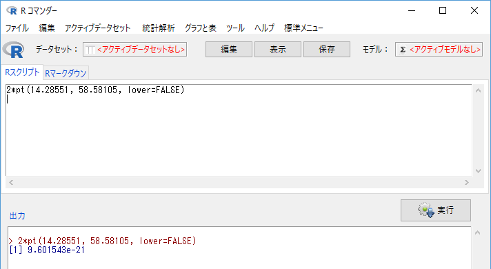 -->
<!-- ``` -->
<!-- \bigskip -->


以下のコードをRスクリプトに入力して，実行をクリックしてください．自分の検定結果と一致するかを確認してください．

```{r eval=FALSE}
source("http://aoki2.si.gunma-u.ac.jp/R/src/my_t_test.R", encoding="euc-jp")
my.t.test(50, 0.67, 0.21^2, 150, 0.23, 0.10^2, var.equal=FALSE)
```


```{r myttest01, cache=TRUE, echo=FALSE, fig.asp=.7, fig.width=6, fig.align='center', out.width='90%'}

```


<!-- \underline{手計算の結果とは一致していると確認できる．} -->


<!-- この検定結果は「両群の脳萎縮度の平均値が等しい」という帰無仮説を棄却するために非常に強い証拠を提供したと言える． -->

<!-- There is strong evidence against the null hypothesis that the means of atrophy are the same in the two groups. -->

\bigskip\bigskip\bigskip\bigskip\bigskip\bigskip\bigskip\bigskip
 

# 問題２：線形回帰モデル

190名の乳幼児の性別（1 = 男，2 = 女），年齢 (月, months)，体重（kg）のデータを収集した．このデータを用いて，以下のことが知りたい：


- 子供の年齢が一ヶ月の上がると，体重はどれぐらい増えているか？

- 男の子は女の子と比べて，平均的に体重はどれぐらい多い/少ないか？

## データのインポート

### ステップ １

```{r import00, cache=TRUE, echo=FALSE, fig.asp=.7, fig.width=6, fig.align='center', out.width='80%'}
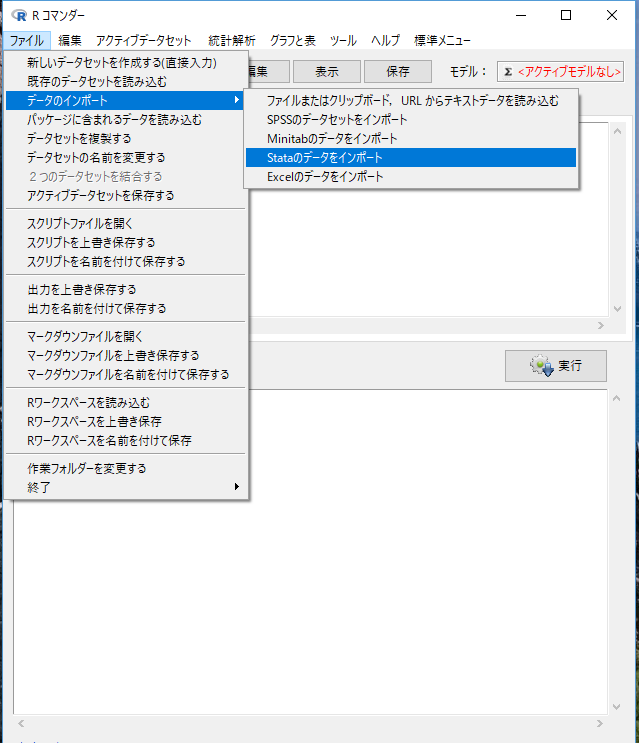
```

### ステップ２

```{r import01, cache=TRUE, echo=FALSE, fig.asp=.7, fig.width=6, fig.align='center', out.width='50%'}
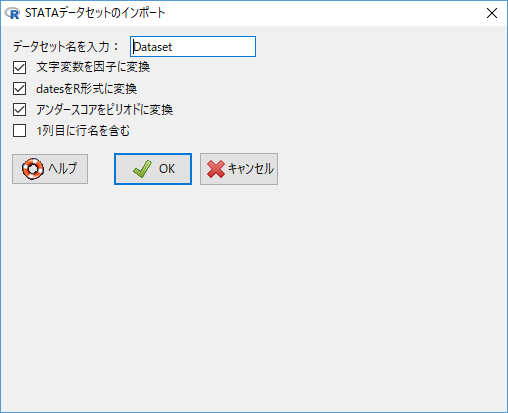
```

### ステップ３

```{r import02, cache=TRUE, echo=FALSE, fig.asp=.7, fig.width=6, fig.align='center', out.width='70%'}
knitr::include_graphics("pic/import03.png")
```


### ステップ４

```{r import03, cache=TRUE, echo=FALSE, fig.asp=.7, fig.width=6, fig.align='center', out.width='50%'}
knitr::include_graphics("pic/import04.png")
```

### ステップ５

```{r import04, cache=TRUE, echo=FALSE, fig.asp=.7, fig.width=6, fig.align='center', out.width='20%'}
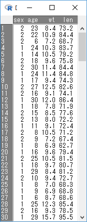
```

## 体重と年齢の散布図，体重の男女別箱ひげ図

```{r scatter00, cache=TRUE, echo=FALSE, fig.asp=.7, fig.width=8, fig.align='center', out.width='85%'}
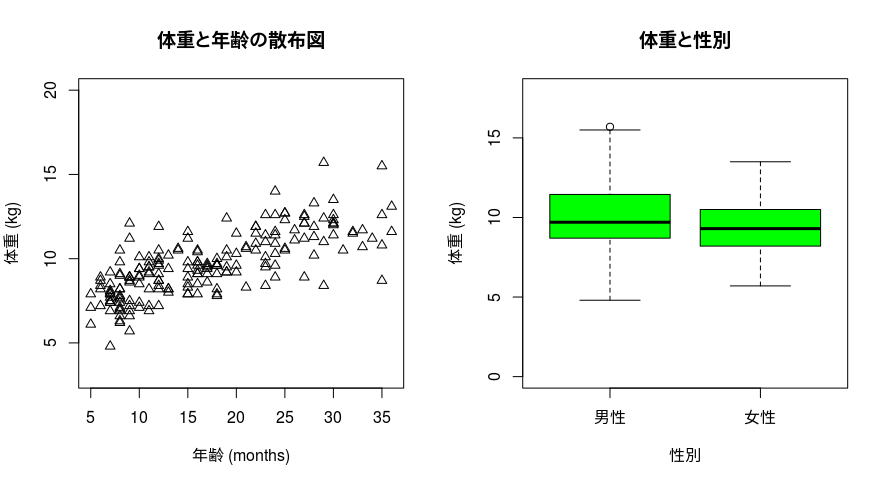
```


上記左のグラフを描くため，以下のコードをRスクリプトに入力して，実行をクリックしてください．

```{r eval=FALSE}
plot(Dataset$age,Dataset$wt, 
     xlab = "年齢 (months)", ylab = "体重 (kg)",
     main = "体重と年齢の散布図",
     ylim = c(3, 20), pch=c(2))
```
\bigskip

```{r scatter01, cache=TRUE, echo=FALSE, fig.asp=.7, fig.width=8, fig.align='center', out.width='80%'}
knitr::include_graphics("pic/scatter01.png")
```


 
 

男女別に体重の箱ひげ図を描くため，以下のコードをRスクリプトに入力して，実行をクリックしてください．

```{r eval=FALSE}
boxplot(Dataset$wt ~ Dataset$sex, ylim = c(0, 18),
        main = "体重と年齢", xlab = "性別", ylab = "体重 (kg)",
        col = "green", names = c("男性", "女性"))
```


```{r box01, cache=TRUE, echo=FALSE, fig.asp=.7, fig.width=8, fig.align='center', out.width='80%'}
knitr::include_graphics("pic/box01.png")
```


```{r scatter, fig.align='center', fig.asp=.7, fig.height=5, fig.width=8, warning=FALSE, cache=TRUE, include=FALSE, out.width='50%'}
par(mfrow=c(1,2))
library(haven)
# Dataset <- read_dta("~/ドキュメント/githubprojects/LSHTMlearningnote/backupfiles/growgam1.dta")
Dataset <- read_dta("../LSHTMlearningnote/backupfiles/growgam1.dta")
plot(Dataset$age,Dataset$wt, 
     xlab = "年齢 (months)", ylab = "体重 (kg)",
     main = "体重と年齢の散布図",
     ylim = c(3, 20), pch=c(2))

boxplot(Dataset$wt ~ Dataset$sex, ylim = c(0, 18),
        main = "体重と性別", xlab = "性別", ylab = "体重 (kg)",
        col = "green", names = c("男性", "女性"))
```


## 年齢，体重それぞれの平均値，分散を求めよ；また，年齢と体重の共分散を算出せよ．なお，EZRで計量データの平均値を計算するには，コマンド `mean(変数名)` を使う；共分散を計算したい時には，コマンド `cov(変数1, 変数2)` を利用する．

以下のコードをRスクリプトに入力して,実行をクリックしてください．\underline{(結果を回答用紙に記入すること)}

```{r eval=FALSE}
# 年齢の平均値
mean(Dataset$age)
# 年齢の分散
var(Dataset$age)
# 体重の平均値
mean(Dataset$wt)
# 体重の分散
var(Dataset$wt)
# 体重と年齢の共分散 covariance
cov(Dataset$wt, Dataset$age)
```


 
 
\newpage
## 年齢を説明変数，体重を目的変数とする場合，年齢の傾き(回帰係数)，と切片を求めよ．なお，分散と共分散の定義は以下とする，$\bar{X}$ は $X$ の平均値を示す：

- 分散 variance:

$$
\begin{aligned}
\mathbf{Var}(X) & = \frac{(X_1-\bar{X})^2+(X_2-\bar{X})^2+\cdots+(X_n-\bar{X})^2}{n - 1} \\
                & = \frac{\sum_{i=1}^n(X_i-\bar{X})^2}{n -1}
\end{aligned}
$$

- 共分散 covariance:

$$
\begin{aligned}
\mathbf{Cov}(X, Y) & = \frac{(X_1 - \bar{X})(Y_1-\bar{Y}) + (X_2 - \bar{X})(Y_2-\bar{Y}) + \cdots + (X_n - \bar{X})(Y_n-\bar{Y})}{n - 1} \\
                   & = \frac{\sum_{i = 1}^n(X_i - \bar{X})(Y_i-\bar{Y})}{n - 1}
\end{aligned}
$$


以下のコードをRスクリプトに入力して,実行をクリックしてください．\underline{(結果を回答用紙記入すること)}

```{r eval=FALSE}
# 傾き (slope)
beta <- cov(Dataset$wt, Dataset$age) / var(Dataset$age)
beta
# 切片 (intercept)
alpha <- mean(Dataset$wt) - mean(Dataset$age)*beta
alpha
```


```{r betaalpha, cache=TRUE, echo=FALSE, fig.asp=.7, fig.width=8, fig.align='center', out.width='80%'}
knitr::include_graphics("pic/betaalpha.png")
```

## 実際にEZRで線形モデルを作ってみよう：

### ステップ１

```{r lm00, cache=TRUE, echo=FALSE, fig.asp=.7, fig.width=8, fig.align='center', out.width='80%'}
knitr::include_graphics("pic/lm00.png")
```

### ステップ２

```{r lm01, cache=TRUE, echo=FALSE, fig.asp=.7, fig.width=8, fig.align='center', out.width='60%'}
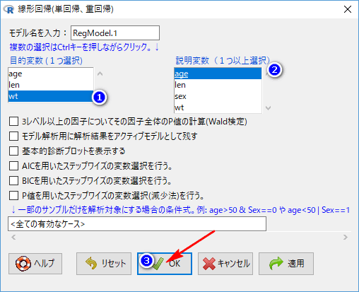
```

### ステップ３

```{r lm02, cache=TRUE, echo=FALSE, fig.asp=.7, fig.width=8, fig.align='center', out.width='80%'}

```
推定された回帰係数が自分の計算結果と一致するかを確認してください．


## 今まで計算した傾きと切片の数字を用いて，年齢と体重の関係を線形と考える場合の計算式を記入せよ．傾きと切片の計算結果の意味をそれぞれ記述せよ．

### 答え  (回答用紙へ)

<!-- $$ -->
<!-- Y = 6.838 + 0.165 X -->
<!-- $$ -->

<!-- - $Y:$ 体重 (kg)； -->
<!-- - $X:$ 年齢 (months)； -->
<!-- - $0.165:$ 子供の年齢が1ヶ月伸びると，体重が平均的 0.165 kg (165 g) 高くなる； -->
<!-- - $6.838:$ 子供の年齢が0ヶ月の時に，体重の平均値は 6.838 kg． -->

\bigskip\bigskip\bigskip\bigskip\bigskip


## 性別を説明変数に入れたモデルを作る

### 性別変数を因子 (factor) に変換する

\newpage
#### ステップ１

```{r sexfactor00, cache=TRUE, echo=FALSE, fig.asp=.7, fig.width=8, fig.align='center', out.width='80%'}
knitr::include_graphics("pic/sexfactor00.png")
```

#### ステップ２

```{r sexfactor01, cache=TRUE, echo=FALSE, fig.asp=.7, fig.width=8, fig.align='center', out.width='40%'}
knitr::include_graphics("pic/sexfactor01.png")
```

#### ステップ３

```{r sexfactor02, cache=TRUE, echo=FALSE, fig.asp=.7, fig.width=8, fig.align='center', out.width='25%'}
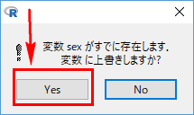
```


#### ステップ４--水準名に男性，女性を入力する

```{r sexfactor03, cache=TRUE, echo=FALSE, fig.asp=.7, fig.width=8, fig.align='center', out.width='25%'}
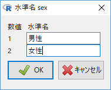
```

### 重回帰線形モデルを作る

#### ステップ１

```{r lm03, cache=TRUE, echo=FALSE, fig.asp=.7, fig.width=10, fig.align='center', out.width='70%'}
knitr::include_graphics("pic/lm00.png")
```

#### ステップ２---複数の説明変数を選択する時に control キーを押しながらマウスで変数名をクリックする

```{r lm04, cache=TRUE, echo=FALSE, fig.asp=.7, fig.width=8, fig.align='center', out.width='50%'}
knitr::include_graphics("pic/lm04.png")
```


### 重回帰線形モデルの結果を確認する

```{r lm05, cache=TRUE, echo=FALSE, fig.asp=.7, fig.width=10, fig.align='center', out.height= "40%", out.width='70%'}

```

## 重回帰線形モデルの計算結果を用いて，体重の平均値を年齢と性別の線形モデルで表示せよ．各回帰係数の意味を説明せよ．

## 答え (回答用紙へ)


## 上記の重回帰線形モデルを用いて，年齢が34ヶ月の女の子の体重の予測値を計算せよ．

## 答え (回答用紙へ)


## 男女別の年齢と体重の散布図を描く

```{r scatter02, cache=TRUE, echo=FALSE, fig.asp=.7, fig.width=8, fig.align='center', out.width='50%'}
knitr::include_graphics("pic/scatter02.png")
```


### ステップ１

```{r scatter00003, cache=TRUE, echo=FALSE, fig.asp=.7, fig.width=8, fig.align='center', out.height='50%' , out.width='50%'}
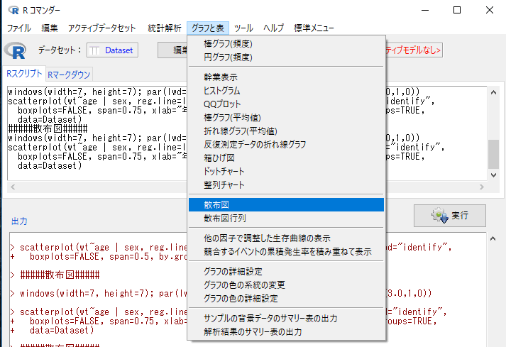
```


#### ステップ２

```{r scatter03, cache=TRUE, echo=FALSE, fig.asp=.7, fig.width=8, fig.align='center', out.width='50%'}
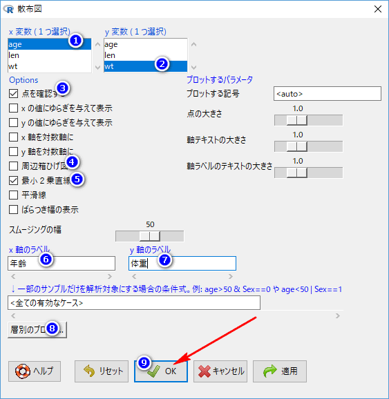
```

#### ステップ３

```{r scatter04, cache=TRUE, echo=FALSE, fig.asp=.7, fig.width=8, fig.align='center', out.width='20%'}
knitr::include_graphics("pic/scatter05.png")
```

#### ステップ４

```{r scatter05, cache=TRUE, echo=FALSE, fig.asp=.7, fig.width=8, fig.align='center', out.width='40%'}
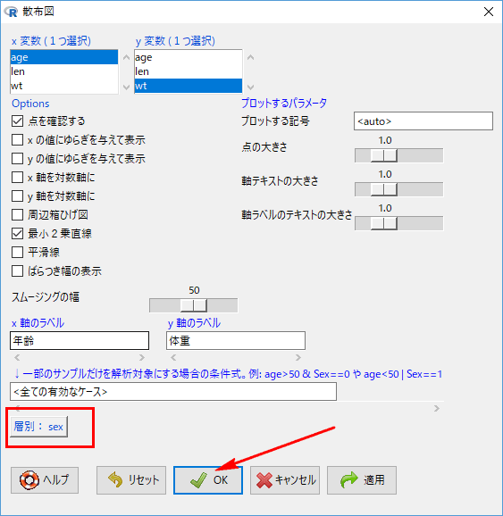
```

#### ステップ５

```{r scatter06, cache=TRUE, echo=FALSE, fig.asp=.7, fig.width=8, fig.align='center', out.width='25%'}
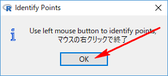
```


# 問題３：$\chi^2$ 検定，オッズ比，ロジスティック回帰モデル
<!-- (SME lecture9) -->

1990年代，アフリカのナイジェリア北部でオンコセルカ症 (回旋糸状虫症, onchocerciasis; river blindness とも呼ばれる) が流行していた．ある研究チームは流行地域にある34個の村に住む15歳以上の全住民に目の検査を行った．目の検査受けた住民はWHOの診断基準をもとに，「視覚障害 (visually impaired)」と「視力正常 (normal vision」に分類された．対象者は 3 年間観察され，その期間中に死亡者が登録された．

<!-- ．また，住民の皮膚検体からマイクロフィラリアの負荷 (microfilarial load)を測定し，糸状虫感染症の強度指標として評価した。 -->

## 視覚障害と死亡の関係

視覚障害の有無と死亡リスクの関連を見るために，以下の表をまとめた：


\begin{center}
\begin{tabular}{|c|c|c|c|}
\hline
死亡 & 視力正常           & 視覚障害          & 合計             \\ \hline
0  & 3874 (97.56\%) & 287 (87.77\%) & 4161 (96.81\%) \\ \hline
1  & 97 (2.44\%)    & 40 (12.23\%)  & 137 (3.19\%)   \\ \hline
合計 & 3971 (100\%)   & 327 (100\%)   & 4298 (100\%)   \\ \hline
\end{tabular}
\end{center}

### もし，視覚障害と対象者の死亡リスクに関連がない場合，下の表（各セルの期待値の人数）を答えよ：


\begin{center}
\begin{tabular}{|c|c|c|c|}
\hline
死亡 & 視力正常                      & 視覚障害                   & 合計             \\ \hline
0  &                                 &                            &   4161 (96.81\%)        \\ \hline
1  &                                 &                            &  137 (3.19\%)    \\ \hline
合計 & 3971 (100\%)             & 327 (100\%)            & 4298 (100\%)   \\ \hline
\end{tabular}
\end{center}

### 上記の２つの表の数字を使って $\chi^2$ 統計量を計算せよ

### 答え (回答用紙へ)
<!-- \bigskip\bigskip\bigskip\bigskip\bigskip\bigskip\bigskip -->
<!-- \bigskip\bigskip\bigskip\bigskip\bigskip\bigskip\bigskip -->


### 2 $\times$ 2 の分割表では，自由度は $\rule{3cm}{0.2mm}$
<!-- \bigskip\bigskip\bigskip\bigskip\bigskip\bigskip\bigskip -->

<!-- $(2-1)\times(2-1) = 1$ ． -->


EZRで，$\chi^2$統計量と自由度(df)を使って P 値を計算したい場合は，以下のコマンドを利用してください：

```{r eval=FALSE}
2*pchisq(chisquare統計量, df, lower = FALSE)
```


```{r eval=FALSE, echo=FALSE}
2*pchisq(93.829, 1, lower = FALSE)
```


```{r chisqtest01, cache=TRUE, echo=FALSE, fig.asp=.7, fig.width=6, fig.align='center', out.width='70%'}

```


以下のコードをRスクリプトに入力して,実行をクリックしてください.自分の検定結果と一致するかを確認し
てください.

```{r chisqtest, eval=FALSE}
source("http://aoki2.si.gunma-u.ac.jp/R/src/my-chisq-test.R", encoding="euc-jp")
a <- my.chisq.test(matrix(c(3874, 97, 287, 40), nrow = 2))
a$expected # 期待者数表
a
```


```{r chisqtest02, cache=TRUE, echo=FALSE, fig.asp=.7, fig.width=6, fig.align='center', out.width='80%'}

```


<!-- \underline{手で計算した結果とは一致していると確認できる．} -->


<!-- この検定結果は「視覚障害と対象者の死亡リスクと関連がない」という帰無仮説を棄却するために非常に強い証拠を提供したと言える． (There is strong evidence against the null hypothesis that there is no association between visual impairment and risk of death.) -->


### 視覚障害と死亡の関係を示すテーブルのデータをもとに，下表を完成せよ：


\begin{center}
\begin{tabular}{|c|c|c|c|}
\hline
                 & 視力正常   & 視覚障害    & 合計   \\ \hline
リスク (risk)       &  &   & 0.0319 \\ \hline
オッズ (odds)       &  &   & 0.0329 \\ \hline
対数オッズ (log-odds) &  &  & -3.414 \\ \hline
\end{tabular}
\end{center}


\bigskip

視覚障害と死亡の関連を示すオッズ比を算出せよ：

<!-- $$ -->
<!-- \mathbf{OR} = 0.1394 \div 0.025 = 5.576 -->
<!-- $$ -->
$$
\mathbf{OR} = 
$$


このオッズ比の対数を取った値 $\mathbf{log(OR)}$ は：

$$
\mathbf{log(OR)} = 
$$

### EZRでロジスティック回帰モデルを作る

#### ステップ１ --- データのインポート

1. 
```{r logistic00, cache=TRUE, echo=FALSE, fig.asp=.7, fig.width=6, fig.align='center', out.width='50%'}

```

 
 

2. 
```{r logistic01, cache=TRUE, echo=FALSE, fig.asp=.7, fig.width=6, fig.align='center', out.width='30%'}
knitr::include_graphics("pic/logstic01.png")
```

\newpage
3. 
```{r logistic02, cache=TRUE, echo=FALSE, fig.asp=.7, fig.width=6, fig.align='center', out.width='70%'}

```


4. 
```{r logistic03, cache=TRUE, echo=FALSE, fig.asp=.7, fig.width=6, fig.align='center', out.width='70%'}
knitr::include_graphics("pic/logstic03.png")
```

 
\newpage
5.
```{r logistic04, cache=TRUE, echo=FALSE, fig.asp=.7, fig.width=6, fig.align='center', out.width='70%'}
knitr::include_graphics("pic/logstic04.png")
```

#### ステップ２ --- ロジスティックモデルを作る

6. 
```{r logistic05, cache=TRUE, echo=FALSE, fig.align='center', out.width = '0.8\\textwidth',  out.height= '0.9\\textwidth'}
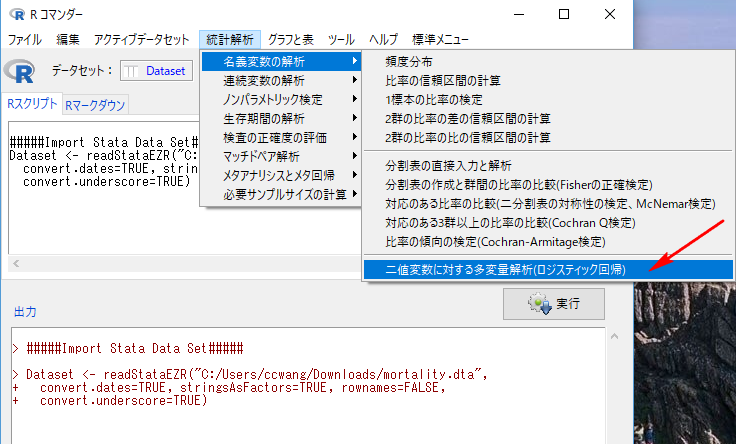
```

 
\newpage
7. 
```{r logistic06, cache=TRUE, echo=FALSE, fig.asp=.7, fig.width=6, fig.align='center', out.width='50%'}
knitr::include_graphics("pic/logstic06.png")
```

8.
```{r logistic07, cache=TRUE, echo=FALSE, fig.asp=.7, fig.width=6, fig.align='center', out.width='50%'}
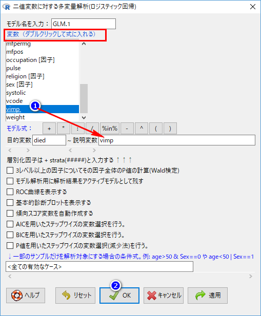
```

 
\newpage
9.
```{r logistic08, cache=TRUE, echo=FALSE, fig.asp=.7, fig.width=6, fig.align='center', out.width='55%'}

```

計算したオッズ比がこの結果と一致しているかを確認してください．


10. 出力のところをスクロールアップすると $\mathbf{log(OR)}$ の結果が確認できる
```{r logistic09, cache=TRUE, echo=FALSE, fig.asp=.7, fig.width=6, fig.align='center', out.width='52%'}

```

- (intercept/切片) は”視力正常”群の対数オッズであることが確認できる；
- `vimp` (視覚障害)の回帰係数は”視覚障害”と”視力正常”群に比べた\newline log(OR) = log(odds in 視覚障害) - log(odds in 視力正常) である．


## 年齢の影響を考慮する

\begin{center}
\begin{tabular}{|c|c|c|c|c|c|c|c|c|c|c|}
\hline
       & \multicolumn{10}{c|}{視覚障害 (0 = no, 1 = yes)}                                                                                                  \\ \hline
死亡     & 0             & 1          & 0            & 1           & 0            & 1           & 0           & 1           & 0            & 1           \\ \hline
1 = yes & 29            & 2          & 38           & 10          & 15           & 11          & 15          & 17          & 97           & 40          \\ \hline
0 = no & 2301          & 22         & 1271         & 124         & 212          & 69          & 90          & 72          & 3874         & 287         \\ \hline
  n     &           &           &          &          &           &           &           &           &          &          \\ \hline
年齢     & \multicolumn{2}{c|}{15-34} & \multicolumn{2}{c|}{35-54} & \multicolumn{2}{c|}{55-64} & \multicolumn{2}{c|}{65 +} & \multicolumn{2}{c|}{Total} \\ \hline
\end{tabular}
\end{center}


上記のデータをよく見ると，視覚障害のオッズは年齢と共に上昇している (年齢が15-34歳群の$(2 + 22) / (29 + 2301) = 0.010$から年齢が65歳以上群の$(17+72)/(15+90) =  0.848$に上がっている)．しかし，年齢の上昇と共に，死亡のオッズも上がる．年齢はここで，\underline{交絡因子 (confounder) }と定義される．

### 以上のデータと解説をよく理解した上で，下表を完成せよ：

\begin{center}
\begin{tabular}{|c|c|c|c|}
\hline
      & \multicolumn{2}{c|}{オッズ}    &        \\ \hline
年齢    & 視力正常              & 視覚障害    & オッズ比   \\ \hline
15-34 & 29/2301 = 0.01260 &   &   \\ \hline
35-54 & 0.02990           &  &  \\ \hline
55-64 & 0.07075           &  &  \\ \hline
65+   & 0.16667           &  &  \\ \hline
\end{tabular}
\end{center}

各年齢層では視覚障害と死亡との関連はどう変化しているか？


 
 
\newpage
### EZRで年齢グループを調整したロジスティック回帰モデルを作る

#### 年齢グループ `agegrp` 変数を因子 (factor) に変換する

1. 
```{r mltlogistic00, cache=TRUE, echo=FALSE, fig.asp=.7, fig.width=6, fig.align='center', out.height = '50%', out.width='55%'}

```


2. 
```{r mltlogistic01, cache=TRUE, echo=FALSE, fig.asp=.7, fig.width=6, fig.align='center', out.height = '50%', out.width='55%'}

```

3. 
```{r mltlogistic02, cache=TRUE, echo=FALSE, fig.asp=.7, fig.width=6, fig.align='center', out.height = '50%', out.width='30%'}

```


 
 

4. 水準名に各年齢グループの名前を入力する
```{r mltlogistic03, cache=TRUE, echo=FALSE, fig.asp=.7, fig.width=6, fig.align='center', out.height = '50%', out.width='30%'}

```


#### 多変量ロジスティック回帰モデルを作る

1. 
```{r mltlogistic04, cache=TRUE, echo=FALSE, fig.asp=.7, fig.width=6, fig.align='center', out.height = '50%', out.width='80%'}

```

 
 

2. `agegrp` が因子になったことが確認できる．\newline `died` (死亡) を目的変数へ，`vimp` (視覚障害) を説明変数へ
```{r mltlogistic05, cache=TRUE, echo=FALSE, fig.asp=.7, fig.width=6, fig.align='center', out.height = '50%', out.width='50%'}

```


3. `agegrp` も説明変数へ移動すると自動的に `+` が付加される．OKをクリックする．

```{r mltlogistic06, cache=TRUE, echo=FALSE, fig.asp=.7, fig.width=6, fig.align='center', out.height = '50%', out.width='50%'}

```

\newpage
4. 視覚障害と死亡の関係を評価する年齢調整オッズ比が計算される．

```{r mltlogistic07, cache=TRUE, echo=FALSE, fig.asp=.7, fig.width=6, fig.align='center', out.height = '50%', out.width='50%'}

```

#### 単変量ロジスティック回帰モデルで評価した粗オッズ比 (crude odds ratio) と比べ，年齢調整オッズ比はどう変わったかを説明せよ．


#### 答え  (回答用紙へ)


<!-- 年齢を考慮していない場合，視覚障害者は視力正常者と比べ，三年間の間に死亡するオッズが5.57倍であり，95%信頼区間が 3.78 - 8.20 と推定される． -->

<!-- 多変量ロジスティック回帰モデルを用いて，視覚障害と死亡の関係に年齢の交絡考慮した後，オッズ比が 2.20 になり，95%信頼区間が 1.41 - 3.44 と推定される．このオッズ比が大きく変化した（小さくなった）ことは，年齢がこの関連の強い交絡因子であることを示唆される．また，年齢調整したオッズ比の95%信頼区間は 1 を跨いでいない．以上の結果を踏まえて，「視覚障害者は視力正常者と比べ，観察期間中に死亡するオッズが有意に高いこと」を支持するために，非常に強い証拠を提供した． -->

<!-- (なお，この解析は，「各年齢層内の視覚障害と死亡の関係が等しい」という前提が仮定される．つまり，2.20は各年齢層の視覚障害と死亡の関係を評価する共通オッズ比 [common odds ratio] である．) -->

 
 
\newpage

# 問題４：生存分析


問題３の研究では対象者が研究に参加した時点，研究終了時点（死亡，打ち切り，及び研究期間が終了した）の日付も記録されている：

```{r showtime, echo=FALSE, cache=TRUE, message=FALSE}
library(haven)
library(tidyverse)
# Dataset <- read_dta("~/ドキュメント/githubprojects/LSHTMlearningnote/backupfiles/growgam1.dta")
Dataset <- read_dta("dataset/mortality.dta")
Dataset %>% 
  mutate(agegrp = factor(Dataset$agegrp, labels = c("15-34", 
                                                    "35-54",
                                                    "55-64",
                                                    "65+")))  %>% 
  select(id, agegrp, enter, exit, vimp, died) %>% 
  print(n = 35)
```

 
 

### EZRでは，追跡期間を計算するために，日付の差を取る必要がある

1. 
```{r survival00, cache=TRUE, echo=FALSE, fig.asp=.7, fig.width=6, fig.align='center', out.height = '50%', out.width='70%'}

```

2. 追跡期間の変数名を `followup` とする
```{r survival01, cache=TRUE, echo=FALSE, fig.asp=.7, fig.width=6, fig.align='center', out.height = '35%', out.width='50%'}

```


3. `followup` を作成したと確認メッセージが出る．追跡期間の要約を調べる：

```{r survival02, cache=TRUE, echo=FALSE, fig.asp=.7, fig.width=6, fig.align='center', out.height = '35%', out.width='70%'}

```

4. イベント別（死亡，打ち切り）により追跡期間を計算する
```{r survival03, cache=TRUE, echo=FALSE, fig.asp=.7, fig.width=6, fig.align='center', out.height = '35%', out.width='55%'}

```

\newpage

5. 
```{r survival04, cache=TRUE, echo=FALSE, fig.asp=.7, fig.width=6, fig.align='center', out.height = '35%', out.width='25%'}

```


6. 
```{r survival05, cache=TRUE, echo=FALSE, fig.asp=.7, fig.width=6, fig.align='center', out.height = '35%', out.width='45%'}

```


7. 単純要約を見ると，死亡者と生存者の追跡期間（日数）の平均値(と中央値)はどちらが長いか？
```{r survival06, cache=TRUE, echo=FALSE, fig.asp=.7, fig.width=6, fig.align='center', out.height = '35%', out.width='55%'}

```


\newpage

8. 層別変数を `vimp` (視覚障害) に変更し，追跡期間の要約を比較する
```{r survival07, cache=TRUE, echo=FALSE, fig.asp=.7, fig.width=6, fig.align='center', out.height = '35%', out.width='25%'}

```


9. 
```{r survival08, cache=TRUE, echo=FALSE, fig.asp=.7, fig.width=6, fig.align='center', out.height = '35%', out.width='45%'}

```


10. 視覚障害者と視力正常者で，追跡期間の違いはあるか？
```{r survival09, cache=TRUE, echo=FALSE, fig.asp=.7, fig.width=6, fig.align='center', out.height = '35%', out.width='55%'}

```


### 生存表とカプランマイヤーグラフを作成する

1. 
```{r survival10, cache=TRUE, echo=FALSE, fig.asp=.7, fig.width=6, fig.align='center', out.height = '35%', out.width='70%'}

```

2. 
```{r survival11, cache=TRUE, echo=FALSE, fig.asp=.7, fig.width=6, fig.align='center', out.height = '50%', out.width='100%'}

```


\newpage
3. 視覚障害者（赤線）と視力正常者（黒線）のカプランマイヤー生存曲線：\newline（点線は95%信頼区間を示す）
```{r survival12, cache=TRUE, echo=FALSE, fig.asp=.7, fig.width=6, fig.align='center', out.height = '50%', out.width='70%'}

```

視覚障害者の生存率は視力正常者より低いことが分かる．

4. log-rank 検定の結果も同時に示される．$p = <2e-16 < 0.00001$の結果から，「視覚障害者と視力正常者の生存曲線が等しい」という帰無仮説を棄却するために非常に強い証拠を提供した．

```{r survival13, cache=TRUE, echo=FALSE, fig.asp=.7, fig.width=6, fig.align='center', out.height = '40%', out.width='60%'}

```

 

5. 生存曲線を作成するための両群の生存率表も確認できる：

```{r survival14, cache=TRUE, echo=FALSE, fig.asp=.7, fig.width=6, fig.align='center', out.height = '40%', out.width='60%'}

```


```{r survival15, cache=TRUE, echo=FALSE, fig.asp=.7, fig.width=6, fig.align='center', out.height = '40%', out.width='60%'}

```

### Cox比例ハザードモデルを作る．

```{r survival16, cache=TRUE, echo=FALSE, fig.asp=.7, fig.width=6, fig.align='center', out.height = '40%', out.width='60%'}

```

2. `followup`を時間へ
```{r survival17, cache=TRUE, echo=FALSE, fig.asp=.7, fig.width=6, fig.align='center', out.height = '40%', out.width='60%'}

```


3. `died`をイベントへ
```{r survival18, cache=TRUE, echo=FALSE, fig.asp=.7, fig.width=6, fig.align='center', out.height = '40%', out.width='60%'}

```
 

4. `vimp` (視覚障害)を説明変数へ，OKをクリックする
```{r survival19, cache=TRUE, echo=FALSE, fig.asp=.7, fig.width=6, fig.align='center', out.height = '40%', out.width='60%'}

```

5. 単変量ハザード比，及び信頼区間の意味を説明せよ．
```{r survival20, cache=TRUE, echo=FALSE, fig.asp=.7, fig.width=6, fig.align='center', out.height = '40%', out.width='60%'}

```

#### 答え (回答用紙へ)


 
6. 年齢調整ハザード比を求めよ．
```{r survival21, cache=TRUE, echo=FALSE, fig.asp=.7, fig.width=6, fig.align='center', out.height = '40%', out.width='60%'}

```


7. 年齢調整ハザード比，及び信頼区間の意味を説明せよ．

```{r survival22, cache=TRUE, echo=FALSE, fig.asp=.7, fig.width=6, fig.align='center', out.height = '40%', out.width='60%'}

```

### 答え (回答用紙へ)


 

# 参考図書：
1. 中澤　港，「Rによる保健医療データ解析演習」，\newline（http://minato.sip21c.org/msb/medstatbookx.pdf）から入手できる
2. 新谷　歩，「みんなの医療統計 12日間で基礎理論とEZRを完全マスター!」．