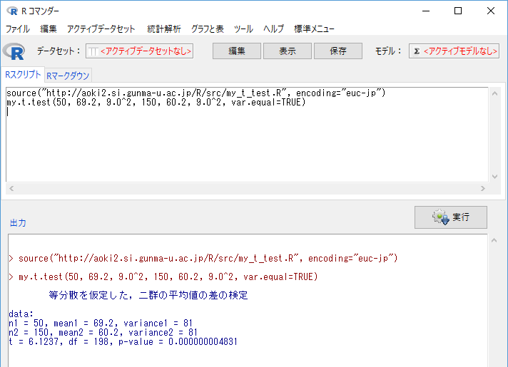
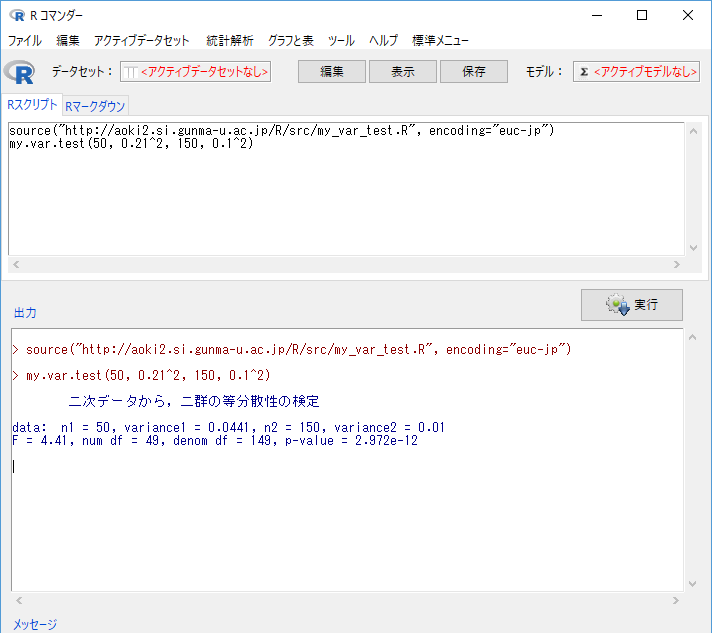

```{r setup, include=FALSE}
knitr::opts_chunk$set(echo = TRUE)
```


# 問題１：両群間計量データの平均値を比較する

<!-- 近年の研究によると，ビタミンＥはがんの発症予防に有用かもしれないと言われている．ある研究者がこの仮説を検証したくて， -->

２００名の認知症患者を募集し，認識能力テスト(cognitive test, COG)，及び脳萎縮の進行度 (brain atrophy, 脳体積の平均年間減少率，単位は%) の検査を全員に行った．COG，及び脳萎縮のデータは大きいほど認知症の進行度がより進んでいる．また，この２００名の参加者から採取した血液検体を利用して，ある遺伝子の変異の有無を検査した．このデータは以下の表でまとめた：

\bigskip
\begin{center}
\begin{tabular}{|l|l|l|l|l|}\hline
変数                     & \multicolumn{2}{c|}{遺伝変異あり (n = 50)}     & \multicolumn{2}{c|}{遺伝変異なし (n = 150)}   \\\hline
                       & \vtop{\hbox{\strut 平均値}\hbox{\strut (mean)}}&\vtop{\hbox{\strut  標準偏差}\hbox{\strut (standard deviation) }} & \vtop{\hbox{\strut 平均値}\hbox{\strut (mean)}}&\vtop{\hbox{\strut  標準偏差}\hbox{\strut (standard deviation) }} \\\hline
認識能力テスト，COG            & 69.2       & 9.0                       & 60.2       & 9.0                       \\
脳萎縮度, atrophy, \%/year & 0.67       & 0.21                      & 0.23       & 0.10                     \\\hline
\end{tabular}
\end{center}
\bigskip

1. 帰無仮説を「遺伝子変異ありと変異なし両群の間に，COGの平均値は等しい」とする．上記のデータ及び適宜な方法を使って検定せよ．検定の結果を分かりやすく説明せよ．なお，分散が等しいと仮定できる場合，以下の式で両群の共通標準偏差が計算できる：

\begin{equation}
  \label{eq:1}
S = \sqrt{\frac{(n_A - 1)S^2_A + (n_B - 1)S^2_B}{n_A + n_B -2}}
\end{equation}

- $S_A:$ A群の標準偏差；
- $n_A:$ A群の人数；
- $S_B:$ B群の標準偏差；
- $n_B:$ B群の人数；
- $S:$ A群及びB群の共通標準偏差；
- $n_A + n_B -2:$ 分散が等しい時の自由度．

また，EZR で t 値，自由度 (degree of freedom)を使って P 値を計算する時，以下のコマンドを利用してください：

```{r eval=FALSE}
2*pt(t value, degree of freedom, lower=FALSE)
```


\newpage
\vfill

## 答え

両群の標準偏差は 9.0 と推定され，分散が等しいと仮定できるから，Student の t 検定を行う：

$$
T = \frac{\bar{X}_A - \bar{X}_B}{S\sqrt{1/n_A + 1/n_B}}
$$

公式(\ref{eq:1})により，共通分散/標準偏差を推定する：
$$
\begin{aligned}
\because\;\;  S & = \sqrt{\frac{(n_A - 1)S^2_A + (n_B - 1)S^2_B}{n_A + n_B -2}} \\
\therefore\;\; S & =  \sqrt{\frac{(50 - 1)9^2 + (150 - 1)9^2}{50 + 150 -2}} = 9 \\
\Rightarrow\;\; T & = \frac{\bar{X}_A - \bar{X}_B}{S\sqrt{1/n_A + 1/n_B}} \\ 
                  & = \frac{69.2 - 60.2}{9\times\sqrt{1/50 + 1/150}} \\ 
                  & = \frac{9}{9\times0.1633} = 6.1237
\end{aligned}
$$

自由度 (degree of freedom)は $n_A + n_B -2 = 198$，P値の計算は EZR を利用する：

```{r eval=TRUE}
2*pt(6.1237, 198, lower=FALSE)
```


```{r pvalue00, cache=TRUE, echo=FALSE, fig.asp=.7, fig.width=6, fig.align='center', out.width='90%'}
knitr::include_graphics("pic/tvaluepvalue00.png")
```
\bigskip

\newpage
\vfill


<!-- \clearpage -->
<!-- \thispagestyle{empty} -->
<!-- \phantom{a} -->
<!-- \vfill -->

以下のコードをRスクリプトに入力して，実行をクリックしてください．自分の検定結果とは一致するかを確認してください．

```{r eval=TRUE}
source("http://aoki2.si.gunma-u.ac.jp/R/src/my_t_test.R", encoding="euc-jp")
my.t.test(50, 69.2, 9.0^2, 150, 60.2, 9.0^2, var.equal=TRUE)
```

```{r myttest00, cache=TRUE, echo=FALSE, fig.asp=.7, fig.width=6, fig.align='center', out.width='90%'}

```
\bigskip


\underline{手計算の結果とは一致していると確認できる．}

この検定結果は「両群のCOG平均値が等しい」という帰無仮説を棄却するために非常に強い証拠を提供したと言える．

There is strong evidence against the null hypothesis that the means of COG are the same in the two groups.

\newpage
\vfill

2. この患者データから，遺伝子変異ありとなしの群の間に脳萎縮度 (atrophy) の比較を 1. と同じ方法で検定してもよいか？どの検定方法を使えば 1. と同じ検定方法を使えるかどうかを判断できるを説明せよ．実際にこの検定方法を行ってください．


なお，EZR で F 値，両群の分散，両群それぞれの自由度 (df) を使って P 値を計算する時に，以下のコマンドを利用してください：

```{r eval=FALSE}
2*pf(F value, df in group 1, df in group 2, lower=FALSE)
```


## 答え

テーブルから両群の標準偏差はそれぞれ 0.21, 0.10 だと推定され，分散 (variance) が等しいという前提が満たされていない．１．の検定方法を使う時には，両群の分散が等しいという前提条件が必須だから，同じ Student t 検定を行うことができない．「両群の分散」が等しいという帰無仮説を検定するには F 検定を利用する：

$$
\begin{aligned}
F & = \frac{S^2_A}{S^2_B} \\
  & = \frac{0.21^2}{0.10^2} \\
  & = 4.41
\end{aligned}
$$


自由度 (degree of freedom)はそれぞれ $n_A - 1 = 49; n_B -2 = 149$，P値の計算は EZR を利用する：

```{r eval=TRUE}
2*pf(4.41, 49, 149, lower.tail = FALSE)
```


```{r ftest, cache=TRUE, echo=FALSE, fig.asp=.7, fig.width=6, fig.align='center', out.width='90%'}
knitr::include_graphics("pic/ftest.png")
```
\bigskip

以下のコードをRスクリプトに入力して，実行をクリックしてください．自分の検定結果とは一致するかを確認してください．

```{r eval=TRUE}
source("http://aoki2.si.gunma-u.ac.jp/R/src/my_var_test.R", encoding="euc-jp")
my.var.test(50, 0.21^2, 150, 0.1^2)
```


```{r ftest01, cache=TRUE, echo=FALSE, fig.asp=.7, fig.width=6, fig.align='center', out.width='90%'}

```
\bigskip

\underline{手計算の結果とは一致していると確認できる．}


この検定結果は「両群の脳萎縮度の分散が等しい」という帰無仮説を棄却するために非常に強い証拠を提供したと言える．

There is strong evidence against the null hypothesis that the variances of atrophy are the same in the two groups.

\newpage
\vfill

3.  2.の結果を踏まえて，帰無仮設「両群の脳萎縮度の平均値が等しい」を検定せよ．なお，両群の分散が等しいという前提が満たされていない時に，自由度(df)の計算式は以下となる：


\begin{equation}
\label{eq:2}
\mathbf{df} = \frac{(S^2_A/n_A + S^2_B/n_B)^2}{(S_A^2/n_A)^2/(n_A-1)+(S_B^2/n_B)^2/(n_B-1)}
\end{equation}

また，EZR で t 値，自由度 (df)を使って P 値を計算する時，以下のコマンドを利用してください：

```{r eval=FALSE}
2*pt(t value, df, lower=FALSE)
```


## 答え

2.の検定結果から，「両群の脳萎縮度の分散が等しい」という帰無仮説を棄却されたため，Welch の t 検定を採用する．

$$
\begin{aligned}
\Rightarrow\;\; T & = \frac{\bar{X}_A - \bar{X}_B}{\sqrt{S^2_A/n_A + S^2_B/n_B}} \\ 
                  & = \frac{0.67 - 0.23}{\sqrt{0.21^2/50 + 0.10^2/150}} \\ 
                  & = \frac{0.44}{\sqrt{0.0009486667}} = 14.28551
\end{aligned}
$$

自由度は公式(\ref{eq:2})により計算できる：

$$
\begin{aligned}
\mathbf{df} & = \frac{(S^2_A/n_A + S^2_B/n_B)^2}{(S_A^2/n_A)^2/(n_A-1)+(S_B^2/n_B)^2/(n_B-1)} \\
            & = \frac{(0.21^2/50 + 0.10^2/150)^2}{(0.21^2/50)^2/(50-1)+(0.10^2/150)^2/(150-1)} \\
            & = 58.58105
\end{aligned}
$$
P値の計算は EZR を利用する：

```{r eval=TRUE}
2*pt(14.28551, 58.58105, lower=FALSE)
```

```{r pvalue01, cache=TRUE, echo=FALSE, fig.asp=.7, fig.width=6, fig.align='center', out.width='90%'}
knitr::include_graphics("pic/tvaluepvalue01.png")
```
\bigskip


以下のコードをRスクリプトに入力して，実行をクリックしてください．自分の検定結果とは一致するかを確認してください．

```{r eval=TRUE}
source("http://aoki2.si.gunma-u.ac.jp/R/src/my_t_test.R", encoding="euc-jp")
my.t.test(50, 0.67, 0.21^2, 150, 0.23, 0.10^2, var.equal=FALSE)
```


```{r myttest01, cache=TRUE, echo=FALSE, fig.asp=.7, fig.width=6, fig.align='center', out.width='90%'}

```
\bigskip


\underline{手計算の結果とは一致していると確認できる．}


この検定結果は「両群の脳萎縮度の平均値が等しい」という帰無仮説を棄却するために非常に強い証拠を提供したと言える．

There is strong evidence against the null hypothesis that the means of atrophy are the same in the two groups.


\newpage
\vfill


# 問題２：線形回帰モデル

190名の乳幼児の性別（1 = 男，2 = 女），年齢 (月, months)，体重（kg）のデータを収集した．このデータを用いで，以下の問題を解答したい：


- 子供の年齢が一ヶ月の増加によって，体重はどれぐらい増えているか？

- 男の子は女の子と比べて，平均的に体重はどれぐらい大きい/小さい？

## データのインポート

### ステップ １

```{r import00, cache=TRUE, echo=FALSE, fig.asp=.7, fig.width=6, fig.align='center', out.width='50%'}
knitr::include_graphics("pic/import00.png")
```

### ステップ２

```{r import01, cache=TRUE, echo=FALSE, fig.asp=.7, fig.width=6, fig.align='center', out.width='50%'}
knitr::include_graphics("pic/import02.png")
```

### ステップ３

```{r import02, cache=TRUE, echo=FALSE, fig.asp=.7, fig.width=6, fig.align='center', out.width='70%'}

```


### ステップ４

```{r import03, cache=TRUE, echo=FALSE, fig.asp=.7, fig.width=6, fig.align='center', out.width='50%'}

```

### ステップ５

```{r import04, cache=TRUE, echo=FALSE, fig.asp=.7, fig.width=6, fig.align='center', out.width='15%'}
knitr::include_graphics("pic/import05.png")
```

## 体重と年齢の散布図，性別により体重の箱ひげ図

```{r scatter00, cache=TRUE, echo=FALSE, fig.asp=.7, fig.width=8, fig.align='center', out.width='85%'}
knitr::include_graphics("pic/scatter00.png")
```


上記左のグラフを描くため，以下のコードをRスクリプトに入力して，実行をクリックしてください．

```{r eval=FALSE}
plot(Dataset$age,Dataset$wt, 
     xlab = "年齢 (months)", ylab = "体重 (kg)",
     main = "体重と年齢の散布図",
     ylim = c(3, 20), pch=c(2))
```
\bigskip

```{r scatter01, cache=TRUE, echo=FALSE, fig.asp=.7, fig.width=8, fig.align='center', out.width='80%'}

```


\newpage
\vfill

性別により体重の箱ひげ図を描くため，以下のコードをRスクリプトに入力して，実行をクリックしてください．

```{r eval=FALSE}
boxplot(Dataset$wt ~ Dataset$sex, ylim = c(0, 18),
        main = "体重と年齢", xlab = "性別", ylab = "体重 (kg)",
        col = "green", names = c("男性", "女性"))
```


```{r box01, cache=TRUE, echo=FALSE, fig.asp=.7, fig.width=8, fig.align='center', out.width='80%'}

```


```{r scatter, fig.align='center', fig.asp=.7, fig.height=5, fig.width=8, warning=FALSE, cache=TRUE, include=FALSE, out.width='50%'}
par(mfrow=c(1,2))
library(haven)
# Dataset <- read_dta("~/ドキュメント/githubprojects/LSHTMlearningnote/backupfiles/growgam1.dta")
Dataset <- read_dta("../LSHTMlearningnote/backupfiles/growgam1.dta")
plot(Dataset$age,Dataset$wt, 
     xlab = "年齢 (months)", ylab = "体重 (kg)",
     main = "体重と年齢の散布図",
     ylim = c(3, 20), pch=c(2))

boxplot(Dataset$wt ~ Dataset$sex, ylim = c(0, 18),
        main = "体重と性別", xlab = "性別", ylab = "体重 (kg)",
        col = "green", names = c("男性", "女性"))
```


## 年齢，体重それぞれの平均値，分散を求めよ；また，年齢と体重の相関係数を算出せよ．なお，EZRで計量データの平均値を計算するには，コマンド `mean(変数名)` を使う；共分散を計算したい時に，コマンド `cor(変数1, 変数2)` を利用する．

以下のコードをRスクリプトに入力して,実行をクリックしてください．(結果を下の余白に記入すること)

```{r eval=TRUE}
# 年齢の平均値
mean(Dataset$age)
# 年齢の分散
var(Dataset$age)
# 体重の平均値
mean(Dataset$wt)
# 体重の分散
var(Dataset$wt)
# 体重と年齢の共分散 covariance
cov(Dataset$wt, Dataset$age)
```


## 年齢を説明変数，体重を目的変数とする場合，年齢の傾き(回帰係数)，と切片を求めよ．なお，分散と共分散の定義を以下とする，$\bar{X}$ は $X$ の平均値を示す：

- 分散 variance:

$$
\begin{aligned}
\mathbf{Var}(X) & = \frac{(X_1-\bar{X})^2+(X_2-\bar{X})^2+\cdots+(X_n-\bar{X})^2}{n - 1} \\
                & = \frac{\sum_{i=1}^n(X_i-\bar{X})^2}{n -1}
\end{aligned}
$$

- 共分散 covariance:

$$
\begin{aligned}
\mathbf{Cov}(X, Y) & = \frac{(X_1 - \bar{X})(Y_1-\bar{Y}) + (X_2 - \bar{X})(Y_2-\bar{Y}) + \cdots + (X_n - \bar{X})(Y_n-\bar{Y})}{n - 1} \\
                   & = \frac{\sum_{i = 1}^n(X_i - \bar{X})(Y_i-\bar{Y})}{n - 1}
\end{aligned}
$$


以下のコードをRスクリプトに入力して,実行をクリックしてください．（結果を下の余白に記入すること）

```{r eval=TRUE}
# 傾き (slope)
beta <- cov(Dataset$wt, Dataset$age) / var(Dataset$age)
beta
# 切片 (intercept)
alpha <- mean(Dataset$wt) - mean(Dataset$age)*beta
alpha
```


```{r betaalpha, cache=TRUE, echo=FALSE, fig.asp=.7, fig.width=8, fig.align='center', out.width='75%'}

```

## 実際にEZRで線形モデルを作って見よう：

### ステップ１

```{r lm00, cache=TRUE, echo=FALSE, fig.asp=.7, fig.width=8, fig.align='center', out.width='80%'}

```

### ステップ２

```{r lm01, cache=TRUE, echo=FALSE, fig.asp=.7, fig.width=8, fig.align='center', out.width='60%'}
knitr::include_graphics("pic/lm01.png")
```

### ステップ３

```{r lm02, cache=TRUE, echo=FALSE, fig.asp=.7, fig.width=8, fig.align='center', out.width='80%'}
knitr::include_graphics("pic/lm02.png")
```
自分の計算結果とは一致するかを確認してください．


## 今まで計算した傾きと切片の数字を用いて，年齢と体重の関係を線形と考える場合の計算式を記入せよ．傾きと切片の計算結果の意味をそれぞれ記述せよ．

### 答え

$$
Y = 6.838 + 0.165 X
$$

- $Y:$ 体重 (kg)；
- $X:$ 年齢 (months)；
- $0.165:$ 子供の年齢が1ヶ月伸びると，体重が平均的 0.165 kg (165 g) 高くなる；
- $6.838:$ 子供の年齢が0ヶ月の時に，体重の平均値は 6.838 kg．


\newpage
\vfill

## 性別を説明変数に入れたモデルを作る

### 性別変数を因子 (factor) に変換する

#### ステップ１

```{r sexfactor00, cache=TRUE, echo=FALSE, fig.asp=.7, fig.width=8, fig.align='center', out.width='80%'}

```

#### ステップ２

```{r sexfactor01, cache=TRUE, echo=FALSE, fig.asp=.7, fig.width=8, fig.align='center', out.width='40%'}
knitr::include_graphics("pic/sexfactor01.png")
```

#### ステップ３

```{r sexfactor02, cache=TRUE, echo=FALSE, fig.asp=.7, fig.width=8, fig.align='center', out.width='15%'}
knitr::include_graphics("pic/sexfactor02.png")
```

#### ステップ４--水準名に男性，女性を入力する

```{r sexfactor03, cache=TRUE, echo=FALSE, fig.asp=.7, fig.width=8, fig.align='center', out.width='15%'}
knitr::include_graphics("pic/sexfactor03.png")
```

### 重回帰線形モデルを作る

#### ステップ１

```{r lm03, cache=TRUE, echo=FALSE, fig.asp=.7, fig.width=10, fig.align='center', out.width='80%'}

```
\bigskip
\bigskip
\bigskip

#### ステップ２---複数の説明変数を選択する時に control キーを押しながらマウスで変数名をクリックする

```{r lm04, cache=TRUE, echo=FALSE, fig.asp=.7, fig.width=8, fig.align='center', out.width='40%'}

```

\newpage
\vfill

### 重回帰線形モデルの結果を確認する

```{r lm05, cache=TRUE, echo=FALSE, fig.asp=.7, fig.width=10, fig.align='center', out.width='80%'}

```


## 重回帰線形モデルの計算結果を用いて，体重の平均値を年齢と性別の線形モデルで表示せよ．各回帰係数の意味を説明せよ．

## 答え


$$
Y = 7.152 + 0.164 X_1 - 0.519X_2
$$

- $Y:$ 体重(kg)；
- $X_1:$ 年齢 (months)；
- $X_2 = 1:$ 女性；
- $X_2 = 0:$ 男性；
- $7.152:$ 男の子が年齢 0 ヶ月の時の平均体重；
- $0.164:$ 同じ性別の子供の年齢が1ヶ月高くなることによって，体重が平均的に 0.164 kg増える；
- $-0.519:$ 子供年齢が同じ時に，女の子は男の子と比べ，体重が平均的に 0.519 kg低い．


\newpage
\vfill


## 上記の重回帰線形モデルを用いて，年齢が34ヶ月の女の子の体重の予測値を計算せよ．

## 答え

- $X_1 = 34$；
- $X_2 = 1$;

$$
\begin{aligned}
Y & = 7.152 + 0.164 \times 34 -0.519\times 1 \\
  & = 12.209\; \mathbf{(kg)}
\end{aligned}
$$

\bigskip\bigskip\bigskip\bigskip\bigskip\bigskip

## 男女別の年齢と体重の散布図を描く

\bigskip\bigskip\bigskip\bigskip\bigskip\bigskip

```{r scatter02, cache=TRUE, echo=FALSE, fig.asp=.7, fig.width=8, fig.align='center', out.width='60%'}

```


### ステップ１

```{r scatter00003, cache=TRUE, echo=FALSE, fig.asp=.7, fig.width=8, fig.align='center', out.height="50%", out.width='50%'}
knitr::include_graphics("pic/scatter03.png")
```


### ステップ２

```{r scatter03, cache=TRUE, echo=FALSE, fig.asp=.7, fig.width=8, fig.align='center', out.width='40%'}
knitr::include_graphics("pic/scatter04.png")
```

### ステップ３

```{r scatter04, cache=TRUE, echo=FALSE, fig.asp=.7, fig.width=8, fig.align='center', out.width='25%'}

```

### ステップ４

```{r scatter05, cache=TRUE, echo=FALSE, fig.asp=.7, fig.width=8, fig.align='center', out.width='50%'}
knitr::include_graphics("pic/scatter06.png")
```

### ステップ５

```{r scatter06, cache=TRUE, echo=FALSE, fig.asp=.7, fig.width=8, fig.align='center', out.width='25%'}
knitr::include_graphics("pic/scatter07.png")
```


# 問題３：$\chi^2$ 検定，オッズ比，ロジスティクス回帰モデル
<!-- (SME lecture9) -->

1990年代，アフリカナイジェリア北部でオンコセルカ症 (回旋糸状虫症, onchocerciasis; river blindness とも呼ばれる) が流行していた．ある研究チームが流行していた地域の34個の村に住む15歳以上の全住民に目の検査を行った．目の検査受けた住民はWHOの診断基準を元に，「視覚障害 (visually impaired)」と「視力正常 (normal vision」に分類された．対象者を三年間観察され，その期間中に死亡者を登録された．

<!-- ．また，住民の皮膚検体からマイクロフィラリアの負荷 (microfilarial load)を測定し，糸状虫感染症の強度指標として評価した。 -->

## 視覚障害と死亡の関係

視覚障害の有無と死亡リスクの関連を見るために，以下の表をまとめた：


\begin{center}
\begin{tabular}{|c|c|c|c|}
\hline
死亡 & 視力正常           & 視覚障害          & 合計             \\ \hline
0  & 3874 (97.56\%) & 287 (87.77\%) & 4161 (96.81\%) \\ \hline
1  & 97 (2.44\%)    & 40 (12.23\%)  & 137 (3.19\%)   \\ \hline
合計 & 3971 (100\%)   & 327 (100\%)   & 4298 (100\%)   \\ \hline
\end{tabular}
\end{center}

### もし，視覚障害と対象者の死亡リスクと関連がない場合，下の表（各セルの期待者数）を入力せよ：


\begin{center}
\begin{tabular}{|c|c|c|c|}
\hline
死亡 & 視力正常                     & 視覚障害                   & 合計             \\ \hline
0  & 3971$\times$4161/4298 = 3844.4232 & 327$\times$4161/4298 = 316.5768 & 4161 (96.81\%) \\ \hline
1  & 3971$\times$137/4298 = 126.5768   & 327$\times$173/4298 = 10.4232   & 137 (3.19\%)   \\ \hline
合計 & 3971 (100\%)             & 327 (100\%)            & 4298 (100\%)   \\ \hline
\end{tabular}
\end{center}

### 上記の２つの表の数字を使って $\chi^2$ 統計量を計算せよ

### 答え

$$
\begin{aligned}
\chi^2 & = \frac{(3874 - 3844.4232)^2}{3844.4232} + \frac{(287 - 316.5768)^2}{316.5768} + \frac{(97 - 126.5768)^2}{126.5768} + \frac{(40 - 10.4232)^2}{10.4232} \\
       & = 93.829
\end{aligned}
$$

### 2 $\times$ 2 の分割表では，自由度は $(2-1)\times(2-1) = 1$ ．


EZRで，$\chi^2$統計量と自由度(df)を使って P 値を計算したい場合，以下のコマンドが利用できる：

```{r eval=FALSE}
2*pchisq(chisquare統計量, df, lower = FALSE)
```


<!-- \newpage -->
<!-- \vfill -->

```{r}
2*pchisq(93.829, 1, lower = FALSE)
```


```{r chisqtest01, cache=TRUE, echo=FALSE, fig.asp=.7, fig.width=6, fig.align='center', out.width='70%'}

```


以下のコードをRスクリプトに入力して,実行をクリックしてください.自分の検定結果とは一致するかを確認し
てください.

```{r chisqtest, eval=TRUE}
source("http://aoki2.si.gunma-u.ac.jp/R/src/my-chisq-test.R", encoding="euc-jp")
a <- my.chisq.test(matrix(c(3874, 97, 287, 40), nrow = 2))
a$expected # 期待者数表
a
```


```{r chisqtest02, cache=TRUE, echo=FALSE, fig.asp=.7, fig.width=6, fig.align='center', out.width='80%'}

```


\underline{手計算の結果とは一致していると確認できる．}


この検定結果は「視覚障害と対象者の死亡リスクと関連がない」という帰無仮説を棄却するために非常に強い証拠を提供したと言える． (There is strong evidence against the null hypothesis that there is no association between visual impairment and risk of death.)

\newpage
\vfill

### 視覚障害と死亡の関係を示すテーブルの数を元に，下表を完成せよ：


\begin{center}
\begin{tabular}{|c|c|c|c|}
\hline
                 & 視力正常   & 視覚障害    & トータル   \\ \hline
リスク (risk)       & 0.0244 & 0.1223  & 0.0319 \\ \hline
オッズ (odds)       & 0.0250 & 0.1394  & 0.0329 \\ \hline
対数オッズ (log-odds) & -3.689 & -1.9704 & -3.414 \\ \hline
\end{tabular}
\end{center}


\bigskip

では，視覚障害者と死亡の関連を示すオッズ比は：

$$
\mathbf{OR} = 0.1394 \div 0.025 = 5.576
$$

このオッズ比の対数を取った値 $\mathbf{log(OR)}$ は：

$$
\mathbf{log(OR)} = 1.717
$$

### EZRでロジスティクス回帰モデルを作る

#### ステップ１ --- データのインポート

1. 
```{r logistic00, cache=TRUE, echo=FALSE, fig.asp=.7, fig.width=6, fig.align='center', out.width='50%'}
knitr::include_graphics("pic/import00.png")
```

\newpage
\vfill

2. 
```{r logistic01, cache=TRUE, echo=FALSE, fig.asp=.7, fig.width=6, fig.align='center', out.width='30%'}

```

3. 
```{r logistic02, cache=TRUE, echo=FALSE, fig.asp=.7, fig.width=6, fig.align='center', out.width='70%'}
knitr::include_graphics("pic/logstic02.png")
```


4. 
```{r logistic03, cache=TRUE, echo=FALSE, fig.asp=.7, fig.width=6, fig.align='center', out.width='70%'}

```

\newpage
\vfill
5.
```{r logistic04, cache=TRUE, echo=FALSE, fig.asp=.7, fig.width=6, fig.align='center', out.width='70%'}

```

#### ステップ２ --- ロジスティクスモデルを作る

6. 
```{r logistic05, cache=TRUE, echo=FALSE, fig.align='center', out.width = '0.8\\textwidth',  out.height= '0.9\\textwidth'}
knitr::include_graphics("pic/logstic05.png")
```

\newpage
\vfill
7. 
```{r logistic06, cache=TRUE, echo=FALSE, fig.asp=.7, fig.width=6, fig.align='center', out.width='50%'}

```

8.
```{r logistic07, cache=TRUE, echo=FALSE, fig.asp=.7, fig.width=6, fig.align='center', out.width='50%'}
knitr::include_graphics("pic/logstic07.png")
```

\newpage
\vfill
9.
```{r logistic08, cache=TRUE, echo=FALSE, fig.asp=.7, fig.width=6, fig.align='center', out.width='55%'}

```

10. 
```{r logistic09, cache=TRUE, echo=FALSE, fig.asp=.7, fig.width=6, fig.align='center', out.width='55%'}

```

\newpage
\vfill

# 問題４：生存分析


\newpage
\vfill

# 参考図書：
1.「Rによる保健医療データ解析演習」，中澤　港，（http://minato.sip21c.org/msb/medstatbookx.pdf）
2.「みんなの医療統計 12日間で基礎理論とEZRを完全マスター!」，新谷　歩．